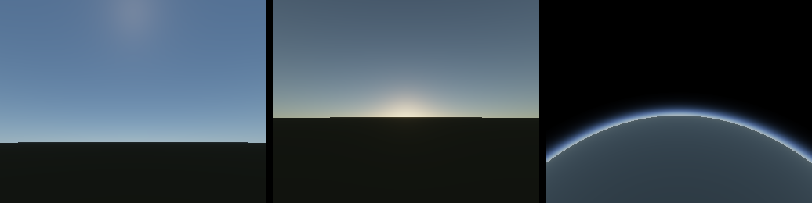
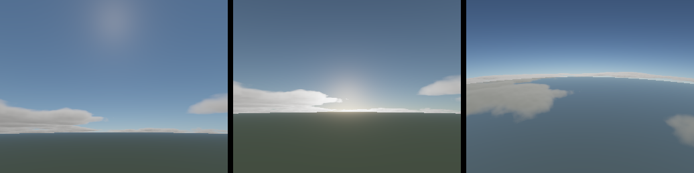
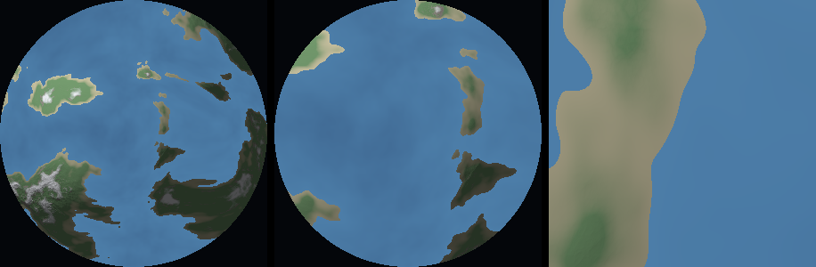

# OrbitForge

A rocket construction and spaceflight simulator with real orbital mechanics, in the
browser. Think Kerbal Space Program: build a rocket, fly it, and have actual physics
decide whether you make orbit.

**Status: milestone 9 of 9, in progress.** The simulation flies a complete multi-body mission.
Build a rocket in the VAB, launch it, reach orbit, wait for a transfer window, burn for
the moon, cross into its sphere of influence, and land — all under patched-conic gravity
with analytic time-warp. Coasting vessels go *on rails*, propagating in closed form: 24
hours and 46 revolutions warp past in 52 frames with a semi-major axis drift of 10⁻¹⁰ m.
The sky is physically based — Rayleigh, Mie and ozone, with a precomputed transmittance
table — so it is blue overhead, white toward the horizon, orange at sunset, and a thin lit
rim from orbit. Above it sits a raymarched volumetric cloud layer, and below it real
terrain: a cube-sphere quadtree over a ridged, domain-warped height field, with continents,
coastlines and mountain ranges. Vegetation and polish are milestones 8 and 9, sequenced in
[docs/PLAN.md](docs/PLAN.md).





The reference launcher, Pathfinder I, deliberately *cannot* reach the moon — it gets an
encounter but crashes at 1.2 km/s. Landing takes a bigger craft, which is what the editor
is for.

## Why the physics comes first

A jittery orbit under a beautiful sky still feels broken; a rock-solid orbit under a
plain sky already feels like a simulator. So milestones 1–4 build the simulation and
milestones 5–8 build the visuals (atmospheric scattering, volumetric clouds, quadtree
planetary terrain, instanced vegetation). The renderer today is deliberately a shaded
sphere and a starfield.

## Running it

```bash
npm install
npm run dev      # http://localhost:5173
npm test         # simulation unit tests
npm run build    # typecheck + production bundle
```

Requires Node 20+. The renderer uses WebGPU via Three.js and falls back to WebGL2
automatically.

### Controls

The game opens in the VAB. Pick a part, click a blue attach node to place it, then
**Launch**. You fly it yourself — the autopilot is a demonstration, on `T`.

Bindings follow Kerbal Space Program's, because that is the muscle memory anyone
arriving here already has.

| Input | Action |
|---|---|
| `W` `S` `A` `D` `Q` `E` | Pitch, yaw, roll |
| `Shift` / `Ctrl` | Throttle up / down |
| `Z` / `X` | Full throttle / cut |
| `Space` | Stage |
| `1`–`8` | Hold: free, prograde, retrograde, normal, anti-normal, radial out/in, node |
| `N` | Plan a manoeuvre node (offers a circularisation) |
| `=` / `-` | Node prograde ± |
| `.` / `,` | Node normal ± |
| `;` / `'` | Node radial ± |
| `[` / `]` | Move the node in time |
| `C` | Clear the node |
| `M` | Map view — the planned orbit is drawn in gold beside the current one |
| `,` / `.` | Time warp down / up |
| `P` | Pause |
| `T` | Hand over to the autopilot |
| `B` / `R` | Back to the VAB / reset |

In the VAB: click a part, click a blue node to place it, `Delete` removes.

## How it works

**Single-body gravity (patched conics).** A vessel only ever feels the gravity of its
current sphere-of-influence owner. This is what KSP does, it keeps orbits analytically
solvable, and it is what makes arbitrary time-warp possible.

Crossing a boundary rewrites the vessel's position and velocity into the new body's
frame. That rewrite has to be *exactly* continuous — the same physical trajectory
described from a different origin — because any error there is a free velocity change at
every crossing. It is checked both in isolation and mid-flight during a real mission.

Warp is clamped whenever a boundary or atmospheric entry is reachable, so nothing is ever
skipped: a vessel cannot be outside a sphere of influence before a step and inside it
after, with the transition never simulated. Orbits that geometrically cannot reach a
boundary skip the check entirely and warp at full speed.

**Two integration regimes, chosen per step.** RK4 for powered and atmospheric flight,
where thrust and drag change fast; analytic Kepler propagation ("rails") for coasting in
vacuum. Plain explicit Euler is deliberately absent — it drifts orbits into garbage.

Rails are not just faster, they are *more* accurate: the orbit's shape is carried
forward exactly rather than re-derived, so `a`, `e` and `i` cannot drift at all. A
100,000x warp costs exactly as much as 1x, because both are one Kepler solve. Warp is
clamped at the next periapsis whenever the orbit dips into atmosphere, so a decaying
orbit can never tunnel through reentry.

**f64 simulation, f32 rendering.** All state is double precision (free in JavaScript).
A floating origin recentres the rendered world on the active vessel every frame, so GPU
coordinates stay small and precise instead of jittering at planetary scale.

**Staging is derived, not declared.** A craft is an attachment tree; a decoupler is a
stage boundary. Counting decouplers along the path from the root gives every part its
stage automatically, so the staging list cannot drift out of sync with the rocket.

**The autopilot adapts to the craft, not the other way round.** It flies a real gravity
turn — kick off vertical, then follow the surface velocity vector — and throttles to hold
a TWR ceiling. An early scripted altitude-to-pitch table worked beautifully for one
reference rocket and flung a booster-heavy build to a 554 km apoapsis; a fixed schedule
silently encodes one vehicle's acceleration curve. Following prograde does not, because
the velocity vector already reflects whatever the player actually built.

**No game physics engine for flight.** Rapier/PhysX-style contact solvers are built for
stacking boxes and are numerically wrong for orbits and multi-scale distances. The flight
model is hand-written. A contact solver will be used later, but only for construction
collision and crash debris.

### Rendering what cannot be seen from here

Three of the last four milestones are visual, and none of them can be checked by running
the game in a test. So they are built the other way round: the model goes in plain
TypeScript with no renderer attached, gets tested against physical facts rather than
appearance, and gets rendered offline to a PNG. The shader is then a deliberate
transcription of code already known to be right.

```bash
npx vite-node tools/renderSkyReference.ts
npx vite-node tools/renderCloudReference.ts
npx vite-node tools/renderTerrainReference.ts
```

It earns its keep. The sky tests caught an inverted transmittance ratio that would have
left the atmosphere unshaded; measuring the integrator found uniform step spacing putting
the zenith 47% below truth; the cloud reference caught a density so high that every cloud
rendered as a black ceiling.

The bugs it does *not* catch are worth knowing too. Terrain shipped with correct vertices,
correct normals and correct precision — while wound inside out, attached to the wrong
parent, and sampled in the wrong rotating frame. Each of those lived in the space between
pieces that were individually right, and none of twenty-two unit tests could see them.
The tests that now guard them compose real world matrices and ask where things ended up.

## The sky

One model produces the blue overhead, the whitening toward the horizon, the orange
sunset and the lit rim from orbit — they are not four special cases. Blue scatters about
5.7x more strongly than red purely from the 1/λ⁴ dependence in the Rayleigh coefficients,
and a sunset is red because the grazing path is long enough to extinguish nearly all the
blue before it arrives.

Transmittance — the fraction of light surviving a path — depends only on altitude and
zenith angle, so it precomputes into a small table once per body and is sampled from then
on. The GPU shader is a deliberate transcription of the CPU implementation in
`src/atmosphere/`, which is unit-tested against physical facts. That matters because a
wrong sky still looks like a sky: the tests, not the eye, are what says it is right.
`npx vite-node tools/renderSkyReference.ts` renders the model to a PNG, which is the
ground truth the game is supposed to match.

## The equations

| | |
|---|---|
| Ideal Δv | `Δv = Isp · g₀ · ln(m_wet / m_dry)` |
| Thrust | `F = ṁ · v_e`, with Isp interpolated by ambient pressure |
| Atmosphere | `ρ = ρ₀ · exp(-h / H)` |
| Drag | `F_d = ½ ρ v² C_d A` |
| Orbit shape | Vis-viva + eccentricity vector → Keplerian elements |
| Propagation | Newton solve of `M = E - e·sin(E)` |
| Transmittance | `T = exp(-∫ σ dt)`, with `σ` from Rayleigh + Mie + ozone |
| Rayleigh phase | `(3/16π)(1 + cos²θ)` |
| Mie phase | Henyey-Greenstein, `g = 0.8` |
| Reentry heating | Sutton-Graves, `q = k·√(ρ/R)·v³` |
| Radiative cooling | Stefan-Boltzmann, `σεT⁴` |
| Manoeuvre node | Δv in the prograde/normal/radial frame, applied at a future true anomaly |

## Layout

```
src/
  sim/      # integrators, orbits, rails, forces, attitude, guidance — no Three.js
  parts/    # catalogue, craft tree, assembler — plain data, no Three.js
  atmosphere/ # scattering model, transmittance LUT — no Three.js
  clouds/   # noise, density field, lighting, raymarch — no Three.js
  terrain/  # cube-sphere, height field, quadtree, chunk meshing — no Three.js
  vegetation/ # species, plant geometry, scatter, placement — no Three.js
  bodies/   # celestial body definitions and ephemeris
  editor/   # the VAB: craft view, panels, click-to-place
  render/   # WebGPU renderer, floating origin, planet/vessel/stars/orbit lines
  ui/       # telemetry HUD
tests/      # deterministic simulation tests
tools/      # offline renderers, e.g. the sky reference image
docs/PLAN.md
```

`sim/`, `parts/`, `atmosphere/`, `clouds/` and `terrain/` import nothing from Three.js. That is a deliberate constraint: it is
what makes the physics unit-testable without a renderer, and it is worth preserving.

## The world

**Terrin**, the homeworld, uses Kerbin-tuned constants rather than real-solar-system
values: 600 km radius, 9.81 m/s² at sea level, 70 km of atmosphere, and a sidereal day of
six hours. Circular orbit just above the atmosphere costs about 2,296 m/s. Reaching orbit
takes minutes, not hours, and the numbers stay small enough to avoid float pain.

**Lunara**, its airless moon, orbits 12,000 km out with a 2,430 km sphere of influence.
The transfer window comes round when Lunara leads the vessel by about 111°, the departure
burn costs roughly 850 m/s, and the crossing takes about seven hours. With no atmosphere
there is nothing to slow a descent but the engine, so landing is flown on thrust alone.

## Roadmap

1. ✅ **Physics vertical slice** — RK4, gravity, atmosphere, staging, ascent to orbit
2. ✅ **Orbital regime** — on-rails Kepler propagation, time warp, orbit lines, map view
3. ✅ **Part editor (VAB)** — attachment tree, radial symmetry, derived staging, live Δv/TWR
4. ✅ **SOI transitions** — Lunara, Hohmann transfers, encounters, powered landing
5. ✅ **Atmospheric scattering** — Rayleigh/Mie/ozone with a precomputed transmittance LUT
6. ✅ **Volumetric clouds** — raymarched, weather-mapped, baked into 3D noise volumes
7. ✅ **Planetary terrain** — cube-sphere quadtree LOD, ridged height field, chunked meshing
8. Vegetation and surface detail — instanced scatter with impostor LODs
9. Polish — reentry heating, engine plumes, sound, camera work

Full technical detail for each in [docs/PLAN.md](docs/PLAN.md).

## Contributing

Two rules worth stating up front: keep `sim/` free of rendering imports, and keep the
simulation tests deterministic. Beyond that, issues and pull requests are welcome.

## License

MIT — see [LICENSE](LICENSE).
